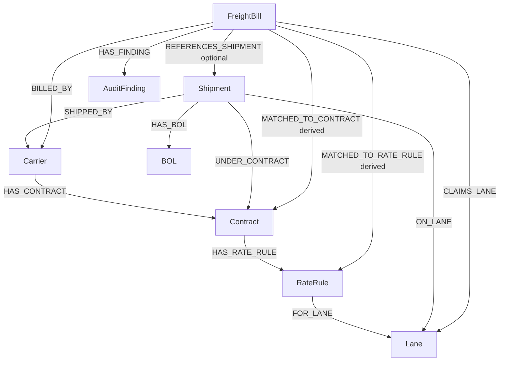

# Freight Bill Graph Blueprint

## Verdict

Current graph idea is a good base, but not enough for this seed data yet.

It must also model:

- Freight bill to shipment reference.
- Shipment to BOL delivery proof.
- Duplicate bill identity.
- Contract date overlap.
- Rate rule units: `kg` and `FTL`.
- Fuel surcharge revision.
- Unknown carrier bills.
- Audit result / decision output.

## Rendered Blueprint



## Core Nodes

### `Carrier`

Transport vendor.

Important fields:

- `id`
- `name`
- `carrier_code`
- `gstin`
- `bank_account`
- `status`

### `Contract`

Rate agreement between shipper and carrier.

Important fields:

- `id`
- `carrier_id`
- `effective_date`
- `expiry_date`
- `status`
- `notes`

### `RateRule`

Lane-level pricing rule inside a contract.

Important fields:

- `lane`
- `rate_per_kg`
- `rate_per_unit`
- `unit`
- `unit_capacity_kg`
- `alternate_rate_per_kg`
- `min_charge`
- `fuel_surcharge_percent`
- `revised_on`
- `revised_fuel_surcharge_percent`

### `Lane`

Route code.

Examples:

- `DEL-BOM`
- `DEL-BLR`
- `BOM-AHM`
- `DEL-BOM-AIR`

### `Shipment`

Actual freight movement.

Important fields:

- `id`
- `carrier_id`
- `contract_id`
- `lane`
- `shipment_date`
- `status`
- `total_weight_kg`

### `BOL`

Bill of lading. Delivery proof.

Important fields:

- `id`
- `shipment_id`
- `delivery_date`
- `actual_weight_kg`

### `FreightBill`

Invoice from carrier.

Important fields:

- `id`
- `carrier_id`
- `carrier_name`
- `bill_number`
- `bill_date`
- `shipment_reference`
- `lane`
- `billed_weight_kg`
- `rate_per_kg`
- `billing_unit`
- `base_charge`
- `fuel_surcharge`
- `gst_amount`
- `total_amount`

### `AuditFinding`

System result for one freight bill.

Useful fields:

- `decision`: `auto_approve`, `review`, `dispute`
- `reason_code`
- `reason_text`
- `expected_amount`
- `claimed_amount`
- `difference_amount`

## Relationship Map

| Relationship | Meaning |
| --- | --- |
| `Carrier HAS_CONTRACT Contract` | Carrier has agreed rate contract. |
| `Contract HAS_RATE_RULE RateRule` | Contract has lane-level pricing. |
| `RateRule FOR_LANE Lane` | Rate applies to route. |
| `Shipment SHIPPED_BY Carrier` | Shipment moved by carrier. |
| `Shipment UNDER_CONTRACT Contract` | Shipment uses contract. |
| `Shipment ON_LANE Lane` | Shipment moved on lane. |
| `Shipment HAS_BOL BOL` | Shipment has delivery proof. |
| `FreightBill BILLED_BY Carrier` | Bill claims carrier. Missing for unknown carrier. |
| `FreightBill CLAIMS_LANE Lane` | Bill claims route. |
| `FreightBill REFERENCES_SHIPMENT Shipment` | Bill points to shipment when `shipment_reference` exists. |
| `FreightBill MATCHED_TO_CONTRACT Contract` | Derived match after date/lane/carrier check. |
| `FreightBill MATCHED_TO_RATE_RULE RateRule` | Derived pricing rule used for validation. |
| `FreightBill HAS_FINDING AuditFinding` | Audit outcome. |

## Why Original Blueprint Was Not Enough

Original blueprint had no `FreightBill -> Shipment` edge.

That breaks:

- `FB-2025-101`: clean shipment match.
- `FB-2025-103`: partial shipment check.
- `FB-2025-104`: cumulative overbilling check.
- `FB-2025-107`: BOL weight vs FTL/alternate kg check.
- `FB-2025-108`: shipment and BOL proof check.

Original blueprint also had no audit output node.

That makes it hard to store:

- duplicate bill result for `FB-2025-109`
- unknown carrier result for `FB-2025-110`
- rate drift result for `FB-2025-105`
- ambiguous contract result for `FB-2025-102`

## Seed Data Coverage Checklist

| Seed case | Covered by revised graph? | Needed graph support |
| --- | --- | --- |
| `FB-2025-101` clean match | Yes | Bill -> shipment -> BOL -> contract. |
| `FB-2025-102` overlapping contracts | Yes | Carrier + lane + bill date can return many contracts. |
| `FB-2025-103` partial delivery | Yes | Shipment can have many bills and BOLs. |
| `FB-2025-104` overbilling | Yes | Sum freight bill weights per shipment. |
| `FB-2025-105` rate drift | Yes | Compare bill rate to matched `RateRule`. |
| `FB-2025-106` expired/wrong contract | Yes | Match by bill date and contract status/date. |
| `FB-2025-107` FTL vs kg | Yes | `RateRule` supports unit + alternate rate. |
| `FB-2025-108` fuel revision | Yes | `RateRule` supports revised fuel fields. |
| `FB-2025-109` duplicate bill | Yes | Unique bill identity: `carrier_id + bill_number`. |
| `FB-2025-110` unknown carrier | Yes | Allow bill without `BILLED_BY` edge, then flag. |

## Matching Rules

1. Check duplicate first with `carrier_id + bill_number`.
2. Match `FreightBill.carrier_id` to `Carrier.id`.
3. If no carrier match, create `AuditFinding` with `review`.
4. Match `FreightBill.lane` to `Lane`.
5. If `shipment_reference` exists, link bill to `Shipment`.
6. Check shipment carrier, lane, and contract.
7. Check BOL actual weight.
8. Sum all freight bills for same shipment before approval.
9. If no `shipment_reference`, infer candidate contracts by carrier + lane + bill date.
10. If more than one candidate contract exists, mark `review`.
11. Compare bill rate to matched `RateRule`.
12. Apply `min_charge`.
13. Apply revised fuel surcharge when `bill_date >= revised_on`.
14. Support `FTL` and alternate `kg` billing.
15. Recompute `base_charge`, `fuel_surcharge`, `gst_amount`, and `total_amount`.

## Important Indexes / Constraints

Use these as graph constraints or lookup indexes:

- `Carrier.id`
- `Contract.id`
- `Shipment.id`
- `BOL.id`
- `FreightBill.id`
- `Lane.code`
- `FreightBill.carrier_id + FreightBill.bill_number`
- `Contract.carrier_id + Contract.effective_date + Contract.expiry_date`
- `RateRule.lane`

## Known Ambiguous Areas In Current Data

### Safexpress `DEL-BOM`

Three contracts can match around April 2025:

- `CC-2024-SFX-001`: 12.50/kg, fuel 8%
- `CC-2024-SFX-002`: 16.00/kg, fuel 5%
- `CC-2025-SFX-003`: 13.20/kg, fuel 9%

This affects `FB-2025-102`.

### Safexpress `DEL-BLR`

Two contracts overlap after `2025-04-01`:

- `CC-2024-SFX-001`: 15.00/kg, fuel 8%
- `CC-2025-SFX-003`: 15.80/kg, fuel 9%

Current `DEL-BLR` bills are dated `2025-02-15`, so they use `CC-2024-SFX-001`.

### TCI `BOM-AHM`

Current contract is `CC-2024-TCI-002`.

It uses:

- `rate_per_unit`: 48000
- `unit`: `FTL`
- `unit_capacity_kg`: 8000
- `alternate_rate_per_kg`: 6.50
- `fuel_surcharge_percent`: 6

This matters for `FB-2025-106` and `FB-2025-107`.

## API

Start Neo4j and Postgres:

```bash
docker compose up -d neo4j
POSTGRES_PORT=55432 docker compose up -d postgres
```

Load the seed graph if needed:

```bash
venv/bin/python data/migration/scripts/load_seed_graph.py
```

Run the API:

```bash
POSTGRES_PORT=55432 venv/bin/uvicorn api.main:app --reload
```

Core endpoints:

```bash
curl -X POST http://127.0.0.1:8000/freight-bills \
  -H 'content-type: application/json' \
  -d '{"id":"FB-2025-102"}'

curl -X POST http://127.0.0.1:8000/freight-bills \
  -H 'content-type: application/json' \
  -d '{"id":"FB-2025-102","decision_mode":"ai"}'

curl http://127.0.0.1:8000/freight-bills/FB-2025-102
curl http://127.0.0.1:8000/review-queue

curl -X POST http://127.0.0.1:8000/review/FB-2025-102 \
  -H 'content-type: application/json' \
  -d '{"decision":"approve","notes":"verified manually"}'
```

The API persists freight bill state, rule checks, evidence, review decisions, and audit events in Postgres. It uses Neo4j for Carrier/Contract/Lane/Shipment/BOL/FreightBill traversal and LangGraph for the review interrupt/resume path. If `OPENAI_API_KEY` is set, explanations are generated with the configured LLM model; otherwise the deterministic fallback explanation is used.

Decision mode defaults to deterministic rules. Set `FREIGHT_AGENT_DECIDER=ai` or pass `"decision_mode":"ai"` to use the AI decision node. AI decision prompts live under `services/agent/decisions/`, and deterministic `_decide` / `_score` remain available. If `OPENAI_API_KEY` is missing or the AI response is invalid, the agent records `decision_source=rules_fallback`.
